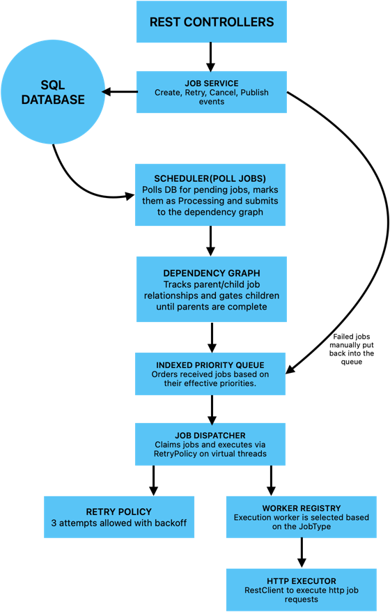

# JobScheduler

A robust, dependency-aware job scheduling system built with Spring Boot. JobScheduler manages job creation, prioritization, dependency resolution, retries with exponential backoff, recurring schedules, and real-time status streaming — all backed by PostgreSQL.

## Table of Contents

- [Features](#features)
- [Tech Stack](#tech-stack)
- [Architecture Overview](#architecture-overview)
- [Getting Started](#getting-started)
    - [Prerequisites](#prerequisites)
    - [Run with Docker Compose](#run-with-docker-compose)
    - [Run Locally](#run-locally)
- [Configuration](#configuration)
- [API Reference](#api-reference)
    - [Job Management](#job-management)
    - [Job Events (SSE)](#job-events-sse)
    - [Mock Endpoints (Testing)](#mock-endpoints-testing)
- [Job Lifecycle](#job-lifecycle)
- [Job Types](#job-types)
- [How It Works](#how-it-works)
    - [Scheduling & Priority](#scheduling--priority)
    - [Dependency Handling](#dependency-handling)
    - [Retry Policy](#retry-policy)
    - [Recurring Jobs](#recurring-jobs)
    - [Real-Time Events](#real-time-events)
- [Database Schema](#database-schema)
- [Running Tests](#running-tests)
- [Project Structure](#project-structure)

---

## Features

- **Priority-based scheduling** — Jobs are processed by priority, with dynamic boosting for overdue high-priority jobs.
- **Dependency graph** — Jobs can depend on other jobs; a job only runs after all its dependencies complete (or are canceled/failed).
- **Automatic retries** — Failed jobs are retried up to 3 times with exponential backoff and jitter.
- **Recurring jobs** — Jobs can be scheduled to re-run at fixed intervals.
- **Delayed execution** — Jobs can be scheduled for a future `scheduledTime`.
- **Real-time updates** — Server-Sent Events (SSE) stream job status changes for single jobs or across all jobs.
- **Concurrent processing** — Virtual threads power the dispatch pipeline for high-concurrency job execution.
- **Safe database claiming** — Uses PostgreSQL `FOR UPDATE SKIP LOCKED` to claim pending jobs without conflicts.
- **Crash-safe schema** — Flyway migrations manage the database schema with JPA `validate` mode.
- **OpenAPI documentation** — Interactive Swagger UI included via springdoc-openapi.
- **Mock endpoints** — Built-in flaky mock services to exercise retry and failure behavior.

## Tech Stack

| Layer        | Technology                                            |
| ------------ | ----------------------------------------------------- |
| Language     | Java 21                                               |
| Framework    | Spring Boot 4.1.0                                     |
| Persistence  | Spring Data JPA / Hibernate                           |
| Database     | PostgreSQL 17                                         |
| Migrations   | Flyway                                                |
| HTTP Client  | Spring RestClient                                     |
| Realtime     | Server-Sent Events (SSE)                              |
| API Docs     | springdoc-openapi (Swagger UI)                        |
| Build Tool   | Maven (with Maven Wrapper)                            |
| Container    | Docker / Docker Compose                               |
| Testing      | JUnit, AssertJ, Spring Boot Test                      |
| Boilerplate  | Lombok                                                |

## Architecture Overview



## Getting Started

### Prerequisites

- **Java 21** (JDK 21+)
- **Maven 3.9+** (or use the bundled Maven Wrapper `./mvnw`)
- **Docker** (for PostgreSQL via Compose, or a local PostgreSQL 17 instance)
- **PostgreSQL 17**

### Run with Docker Compose

The easiest way to run the full stack (app + PostgreSQL):

```bash
# 1. Build the jar
./mvnw clean package

# 2. Build and start containers
docker compose up --build
```

The application will be available at:

- **API:** http://localhost:8080
- **Swagger UI:** http://localhost:8080/swagger-ui.html
- **PostgreSQL:** `localhost:5433` (host port mapped from container)

> **Note:** The Docker Compose setup injects `DB_URL`, `DB_USERNAME`, and `DB_PASSWORD` from the `.env` file into the app container.

### Run Locally

#### 1. Start PostgreSQL

Using Docker:

```bash
docker run -d \
  --name scheduler-postgres \
  -e POSTGRES_DB=scheduler \
  -e POSTGRES_USER=scheduler_user \
  -e POSTGRES_PASSWORD=password \
  -p 5432:5432 \
  postgres:17
```

Or use the Compose file with only the database service:

```bash
docker compose up postgres
```

#### 2. Configure environment variables

The application reads its datasource settings from environment variables (see [Configuration](#configuration)).

For local development, you can override with the `dev` profile, which hardcodes a local PostgreSQL connection:

```bash
export SPRING_PROFILES_ACTIVE=dev
```

Or set environment variables explicitly:

```bash
export DB_URL=jdbc:postgresql://localhost:5432/scheduler
export DB_USERNAME=scheduler_user
export DB_PASSWORD=password
```

#### 3. Run the application

```bash
./mvnw spring-boot:run
```

Or build and run the jar:

```bash
./mvnw clean package
java -jar target/jobscheduler.jar
```

Flyway will automatically create and migrate the schema on startup.

## Configuration

### Environment Variables

| Variable         | Default          | Description                                   |
| ---------------- | ---------------- | --------------------------------------------- |
| `DB_URL`         | — (required)                       | JDBC URL for PostgreSQL                       |
| `DB_USERNAME`    | — (required)                       | PostgreSQL username                           |
| `DB_PASSWORD`    | — (required)                       | PostgreSQL password                           |
| `POSTGRES_DB`    | `scheduler`      | Database name (used by Docker Compose)        |
| `POSTGRES_USER`  | `scheduler_user` | DB user (used by Docker Compose)              |
| `POSTGRES_PASSWORD` | `password` | DB password (used by Docker Compose)          |
| `DB_HOST`        | `postgres` | DB host (used by Docker Compose)              |
| `DB_PORT`        | `5433` | Host port for PostgreSQL in Compose           |
| `APP_PORT`       | `8080`  | Host port for the app in Compose              |


## API Reference

### Job Management

Base URL: `/jobs`

#### Create a Job

```http
POST /jobs
Content-Type: application/json
```

**Request Body:**

| Field           | Type             | Required | Description                                       |
| --------------- | ---------------- | -------- | ------------------------------------------------- |
| `type`          | `JobType`        | Yes      | `EMAIL`, `WEBHOOK_DELIVERY`, or `LOG_PROCESSING`  |
| `priority`      | `int`            | Yes      | Priority (higher = more important)                |
| `payload`       | `string`         | No       | Arbitrary JSON/text payload for the worker        |
| `interval`      | `int`            | No       | Recurrence interval in **seconds** (`0` = one-off)|
| `scheduledTime` | `Instant` (ISO-8601) | No   | When the job should run (defaults to now)         |
| `dependencies`  | `UUID[]`         | No       | IDs of jobs that must finish before this one runs |

**Example:**

```json
{
  "type": "EMAIL",
  "priority": 2,
  "payload": "{\"to\": \"user@example.com\", \"subject\": \"Welcome!\"}",
  "scheduledTime": "2026-08-02T13:30:00Z",
  "dependencies": ["550e8400-e29b-41d4-a716-446655440000"]
}
```

**Response — `201 Created`:**

```json
{
  "id": "550e8400-e29b-41d4-a716-446655440000"
}
```

**Errors:**

- `400 Bad Request` — invalid body (see `ErrorDTO`)

#### Cancel a Job

```http
DELETE /jobs/{jobId}
```

Cancels a job. If the job is currently processing, its worker task is interrupted.

**Response:** `204 No Content`

**Errors:**

- `404 Not Found` — job doesn't exist
- `400 Bad Request` — job is already completed

#### Retry a Failed Job

```http
POST /jobs/{jobId}/retry
```

Re-queues a failed job for another attempt. Only `FAILED` jobs can be retried.

**Response:** `202 Accepted`

**Errors:**

- `404 Not Found` — job doesn't exist
- `400 Bad Request` — job is not in `FAILED` status

#### Error Response Format

All errors use the standard `ErrorDTO`:

```json
{
  "timestamp": "2026-08-02T13:37:00Z",
  "status": 404,
  "error": "Job Not Found",
  "message": "Job with id 550e8400-e29b-41d4-a716-446655440000 was not found",
  "path": "/jobs/550e8400-e29b-41d4-a716-446655440000"
}
```

### Job Events (SSE)

Base URL: `/api/jobs`

Server-Sent Events are available to stream real-time job status changes. Events are named `job-status` and carry the `JobStatusChangedEvent` payload.

#### Stream events for a single job

```http
GET /api/jobs/{id}/events
Accept: text/event-stream
```

Useful for a job detail page. Emits events only for that specific job.

#### Stream events for all jobs

```http
GET /api/jobs/events
Accept: text/event-stream
```

Useful for a dashboard. Emits status updates for every job.

**Example SSE frame:**

```
event: job-status
id: 550e8400-e29b-41d4-a716-446655440000-1722602220000
data: {"jobId":"550e8400-e29b-41d4-a716-446655440000","status":"COMPLETED","occurredAt":"2026-08-02T13:37:00Z"}
```

> Connections time out after 30 minutes. Dead connections are cleaned up automatically.

### Mock Endpoints (Testing)

Base URL: `/mockjobs`

These endpoints simulate flaky external services so you can test retry and failure behavior without integrating real services. They are hidden from Swagger docs.

| Method | Endpoint                            | Description                                      |
| ------ | ----------------------------------- | ------------------------------------------------ |
| POST   | `/mockjobs/email/{jobId}`           | Flaky email service — fails first N attempts, then succeeds |
| POST   | `/mockjobs/log/{jobId}`             | Flaky log service — always fails after N attempts |
| POST   | `/mockjobs/_admin/config?failuresBeforeSuccess=X&failuresBeforeFailure=Y` | Configure failure thresholds at runtime |
| POST   | `/mockjobs/_admin/reset`            | Reset all attempt counters                       |
| GET    | `/mockjobs/_admin/attempts/{jobId}` | Check how many times a job has been attempted    |

Example curl:

```bash
# Create a job
curl -X POST http://localhost:8080/jobs \
  -H "Content-Type: application/json" \
  -d '{"type":"EMAIL","priority":1,"payload":"{\"subject\":\"Test\"}"}'

# Subscribe to real-time events
curl -N http://localhost:8080/api/jobs/events
```

## Job Lifecycle

```
                    ┌──────────┐
                    │  PENDING │ ◄────────────────────┐
                    └────┬─────┘                      │ create
                         │ scheduler claims (SKIP     │
                         │ LOCKED + dependencies met) │
                         ▼                            │
                    ┌────────────┐                    │
                    │ PROCESSING │  workerInterrupted │
                    └────┬───────┘  (cancel)          │
                         │
              ┌──────────┼──────────┐
              ▼          ▼          ▼
        ┌─────────┐ ┌─────────┐ ┌─────────┐
        │COMPLETED│ │ FAILED  │ │CANCELED │
        └─────────┘ └────┬────┘ └─────────┘
                         │
                         │  POST /jobs/{id}/retry
                         ▼
                    ┌──────────┐
                    │  PENDING │
                    └──────────┘
```

1. **PENDING** — Created and waiting to be claimed. Only jobs whose `scheduledTime` has passed are eligible.
2. **PROCESSING** — Claimed by the scheduler and dispatched to a worker.
3. **COMPLETED** — Worker succeeded.
4. **FAILED** — Exhausted all retry attempts or hit a non-retryable error. Can be manually retried via the API.
5. **CANCELED** — Canceled via API, or interrupted mid-execution.

## Job Types

| Type                | Description                              | Worker           |
| ------------------- | ---------------------------------------- | ---------------- |
| `EMAIL`             | Sends an email via the mock email service | `EmailWorker`    |
| `WEBHOOK_DELIVERY`  | Delivers a webhook via the email service (same worker path) | `EmailWorker` |
| `LOG_PROCESSING`    | Processes log data via the mock log service | `LogWorker`    |

Workers are registered in a `WorkerRegistry` keyed by `JobType`. To add a new job type:

1. Add the value to the `JobType` enum.
2. Implement the `Worker` interface.
3. Annotate with `@Component` — it is auto-registered into the `WorkerRegistryImpl`.

## How It Works

### Scheduling & Priority

The scheduler polls the database every **1 second** with a `FOR UPDATE SKIP LOCKED` query to claim up to 20 due `PENDING` jobs:

```sql
SELECT * FROM jobs
WHERE status = 'PENDING'
  AND scheduled_time <= NOW()
ORDER BY priority, scheduled_time, created_at
FOR UPDATE SKIP LOCKED
LIMIT :limit
```

Claimed jobs are inserted into an **`IndexedPriorityQueue`** — a binary max-heap with a position map for `O(log n)` removal. Jobs are ordered by an **effective priority**, computed as:

```
effectivePriority = (priority × 1000)
                  + timeOverdueBonus      (up to +2000 for priority-1 jobs, +1000 for priority-2)
                  + ageBonus              (up to +500 for long-waiting jobs)
```

Every **30 seconds**, the queue is reclassified so overdue jobs get progressively more urgent.

### Dependency Handling

The `DependencyGraph` tracks relationships between jobs:

- Each job's `dependencies` are stored in the `job_dependencies` table.
- When a job is claimed, the graph counts how many of its dependencies are not yet finished.
- The job is only added to the ready queue once all dependencies are `COMPLETED`, `CANCELED`, or `FAILED`.
- When a job finishes, its dependents are checked and released if ready.

This enables efficient fan-out: one completed job can release many waiting jobs at once.

### Retry Policy

The `RetryPolicy` wraps job execution with up to **3 attempts** (initial + 2 retries):

- **Retryable failures** — `HttpServerErrorException` (5xx), or error messages containing keywords like `timeout`, `connection`, `rate limit`, `quota`, `503`, `429`, `temporarily unavailable`.
- **Non-retryable failures** — 4xx client errors or unknown messages fail immediately.
- **Backoff** — Exponential backoff starting at 1s, multiplied by 5 per attempt, plus up to 1s of random jitter.
- **Interruptions** — If a worker is interrupted (e.g., job canceled), the worker is stopped and the job is marked `CANCELED`.

| Attempt | Backoff range        |
| ------- | -------------------- |
| 1       | 1s – 2s              |
| 2       | 5s – 6s              |
| 3       | 25s – 26s            |

### Recurring Jobs

Jobs with `interval > 0` are recurring. When a recurring job completes, the scheduler automatically creates a new `PENDING` job with:

```
nextScheduledTime = currentScheduledTime + interval seconds
```

The new job inherits the same type, priority, payload, and interval.

### Real-Time Events

Every status change publishes a `JobStatusChangedEvent` through Spring's `ApplicationEventPublisher`:

- `PENDING` — on job creation
- `COMPLETED` — on successful execution
- `FAILED` — on failure after retries exhausted
- `CANCELED` — on cancellation

An async `JobEventListener` forwards events to all subscribed SSE clients via the `JobEventEmitterRegistry`. Two subscription modes are supported:

- **Per-job** (`/api/jobs/{id}/events`)
- **Broadcast** (`/api/jobs/events`)

Dead connections are cleaned up on completion, timeout (30 min), and errors.

## Database Schema

Managed by Flyway (`src/main/resources/db/migration/V1__create_jobs_table.sql`).

### `jobs`

| Column              | Type                        | Notes                                 |
| ------------------- | --------------------------- | ------------------------------------- |
| `id`                | `UUID`                      | Primary key                           |
| `type`              | `VARCHAR(255)`              | Job type (`EMAIL`, etc.)              |
| `status`            | `VARCHAR(255)`              | `PENDING`, `PROCESSING`, etc.         |
| `retry_count`       | `INTEGER`                   | Default `0`                           |
| `payload`           | `TEXT`                      | Arbitrary worker payload              |
| `priority`          | `INTEGER`                   | Scheduling priority                   |
| `recurring_interval`| `INTEGER`                   | Seconds between recurrences (`0` = one-off) |
| `scheduled_time`    | `TIMESTAMP WITH TIME ZONE`  | Earliest execution time               |
| `error_message`     | `TEXT`                      | Last failure message                  |
| `created_at`        | `TIMESTAMP WITH TIME ZONE`  | Auto-set on creation                  |

### `job_dependencies`

| Column               | Type    | Notes                                  |
| -------------------- | ------- | -------------------------------------- |
| `id`                 | `UUID`  | Primary key                            |
| `job_id`             | `UUID`  | FK → `jobs(id)` — the dependent job    |
| `depends_on_job_id`  | `UUID`  | FK → `jobs(id)` — the parent job       |

Unique constraint on `(job_id, depends_on_job_id)` prevents duplicate edges.

## Running Tests

```bash
./mvnw test
```

The test suite covers:

| Test Class                    | Coverage                                           |
| ----------------------------- | -------------------------------------------------- |
| `SchedulerTest`               | Scheduler behavior: claiming, completion, failure, cancellation, recurring jobs |
| `RetryPolicyTests`            | Retry logic: retryable vs non-retryable errors, backoff calculation, max attempts |
| `DependencyGraphTest`         | Dependency release ordering and graph state        |
| `IndexedPriorityQueueTest`    | Heap insert/extract/remove operations and ordering |
| `JobschedulerApplicationTests`| Spring context loading                             |

## Project Structure

```
jobscheduler/
├── Dockerfile
├── docker-compose.yml
├── .env
├── mvnw / mvnw.cmd
├── pom.xml
└── src/
    ├── main/
    │   ├── java/com/dilamme/jobscheduler/
    │   │   ├── JobschedulerApplication.java      # Spring Boot entry point
    │   │   ├── client/
    │   │   │   └── HttpExecutor.java             # RestClient wrapper for workers
    │   │   ├── controller/
    │   │   │   ├── JobController.java            # /jobs endpoints
    │   │   │   ├── FlakyJobController.java       # /mockjobs test services
    │   │   │   └── ErrorHandler.java             # Global exception handling
    │   │   ├── dtos/
    │   │   │   ├── IncomingJob.java              # Job creation request
    │   │   │   └── ErrorDTO.java                 # Standard error response
    │   │   ├── entities/
    │   │   │   ├── Job.java                      # Job entity
    │   │   │   └── JobDependency.java            # Dependency edge entity
    │   │   ├── enums/
    │   │   │   ├── JobStatus.java                # Lifecycle states
    │   │   │   └── JobType.java                  # Supported job types
    │   │   ├── events/
    │   │   │   └── JobStatusChangedEvent.java    # Status change event
    │   │   ├── repository/
    │   │   │   ├── JobRepository.java            # JPA with claim query
    │   │   │   └── JobDependencyRepository.java
    │   │   ├── scheduler/
    │   │   │   ├── Scheduler.java                # Polls DB, manages lifecycle
    │   │   │   ├── JobDispatcher.java            # Consumes queue, runs workers
    │   │   │   ├── DispatchQueue.java            # Blocking dispatch queue
    │   │   │   ├── JobQueue.java                 # Queue interface
    │   │   │   ├── IndexedPriorityQueue.java     # Heap-based priority queue
    │   │   │   ├── DependencyGraph.java          # Dependency tracking
    │   │   │   ├── RetryPolicy.java              # Retry + backoff logic
    │   │   │   ├── WorkerRegistry.java           # Worker lookup interface
    │   │   │   └── WorkerRegistryImpl.java       # Auto-registers workers
    │   │   ├── service/
    │   │   │   └── JobService.java               # Create/cancel/retry logic
    │   │   ├── sse/
    │   │   │   ├── JobEventEmitterRegistry.java  # SSE emitter management
    │   │   │   ├── JobEventListener.java         # Async event forwarding
    │   │   │   └── JobEventsController.java      # /api/jobs SSE endpoints
    │   │   ├── startup/
    │   │   │   └── DispatcherStarter.java        # Starts dispatcher threads
    │   │   └── workers/
    │   │       ├── Worker.java                   # Worker interface
    │   │       ├── EmailWorker.java              # EMAIL / WEBHOOK worker
    │   │       └── LogWorker.java                # LOG_PROCESSING worker
    │   └── resources/
    │       ├── application.properties            # Main config
    │       ├── application-dev.properties        # Local dev DB config
    │       ├── db/migration/
    │       │   └── V1__create_jobs_table.sql     # Initial schema
    │       ├── static/                           # Static resources
    │       └── templates/                        # View templates
    └── test/
        └── java/com/dilamme/jobscheduler/
            ├── JobschedulerApplicationTests.java
            └── scheduler/
                ├── SchedulerTest.java
                ├── RetryPolicyTests.java
                ├── DependencyGraphTest.java
                └── IndexedPriorityQueueTest.java


